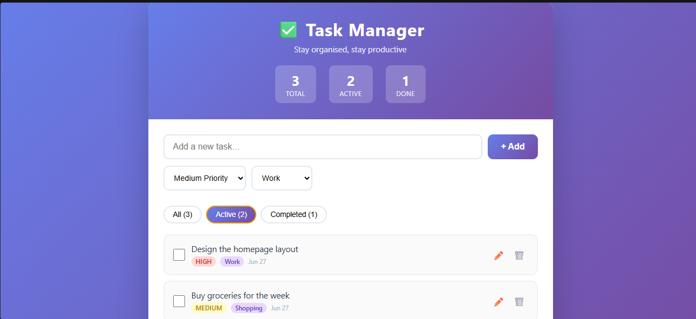

# 📝 Task Manager

A simple and responsive Task Manager web application built using **HTML, CSS, JavaScript, and React**.

## 🚀 Features

- ➕ Add new tasks
- ✏️ Edit existing tasks
- 🗑️ Delete tasks
- ✅ Mark tasks as completed
- 🔄 Filter tasks (All, Active, Completed)
- 📊 Task statistics (Total, Active, Done)
- 🏷️ Task categories
- ⚡ Task priorities (High, Medium, Low)
- 📱 Responsive design
- 🎨 Modern and clean user interface

## 🛠️ Technologies Used

- HTML5
- CSS3
- JavaScript (ES6)
- React (CDN)
- ReactDOM
- Babel

## 📂 Project Structure

```
task-manager/
│── index.html
│── README.md
```

## ▶️ How to Run

1. Download or clone this repository.

```bash
git clone https://github.com/shivank-007/task-manager.git
```

2. Open the project in Visual Studio Code.

3. Install the **Live Server** extension.

4. Right-click on `index.html` and select **Open with Live Server**.

## 📸 Screenshot



## 🌐 Live Demo

Coming Soon

## 👨‍💻 Author

**Shivank**

GitHub: https://github.com/shivank-007

## 📄 License

This project is created for learning and educational purposes.
